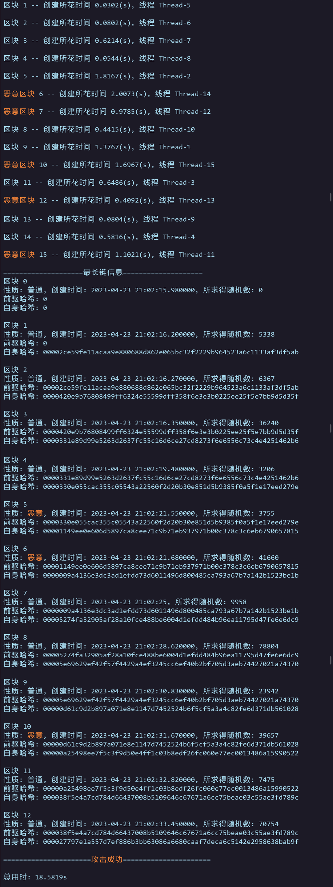
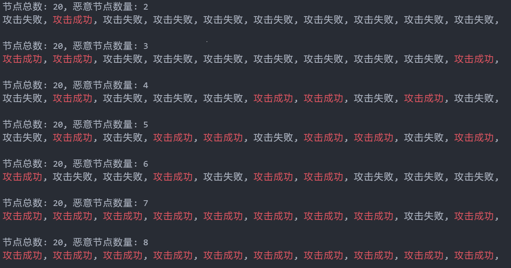

## POW 简易仿真程序
### 1. 设计要求

- 多线程，每个线程代表一个节点
- 调节 PoW 的难度系数，得到合适的出块时间
- 可调整节点总数和恶意节点的数量，并分析不同情况下的攻击结果

### 2. 运行

#### 2.1 单次运行

直接通过 `python build.py <节点总数> <恶意节点数量>` 即可实现单次运行。

- POW 的工作量参数位于 [proof_of_work.py](https://github.com/Dofgal/IS416-POW/blob/main/proof_of_work.py#L11) 中，自行修改即可
- 恶意节点存在休眠期，即链的长度不足某一阈值时，恶意节点不会有动作，参数位于 [build.py](https://github.com/Dofgal/IS416-POW/blob/main/build.py#L104) 中
- 建议将节点总数设置在 10 及以上；否则恶意节点启动时，剩余的普通节点已不会很多

运行示例：

#### 2.2 批量测试

对 `build.py` 的输出信息稍作修改，生成 `batch_test.py`；注释掉 `proof_of_work.py` 的所有输出信息；配合 Powershell 脚本 `batch_test.ps1` 进行批量测试，将节点总数定为 20，恶意节点的数量从 2 增长到 8，每个比例测试 10 轮，观察其攻击的结果：

